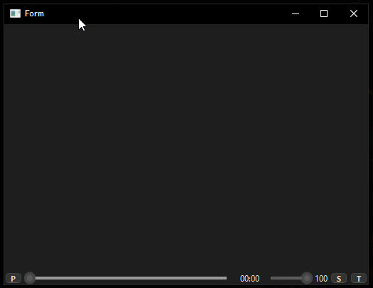

# videoplayer mpv (pyside6)

video player basico realizado con:
 - python 3.13.5
 - PySide6==6.9.1
 - python-mpv==1.0.8

 

## mejoras adicionales

```cmd
# Para videos de alta resolución, añade:
video_scale='ewa_lanczossharp'  # Mejor escalado
profile='gpu-hq'  # Perfil de alta calidad GPU

# Para mejor rendimiento en sistemas lentos:
framedrop='vo'  # Permitir drop de frames
video_sync='audio'  # Sincronización menos exigente
```

## todo
- [ ] soporte para linux
- [x] usar logging